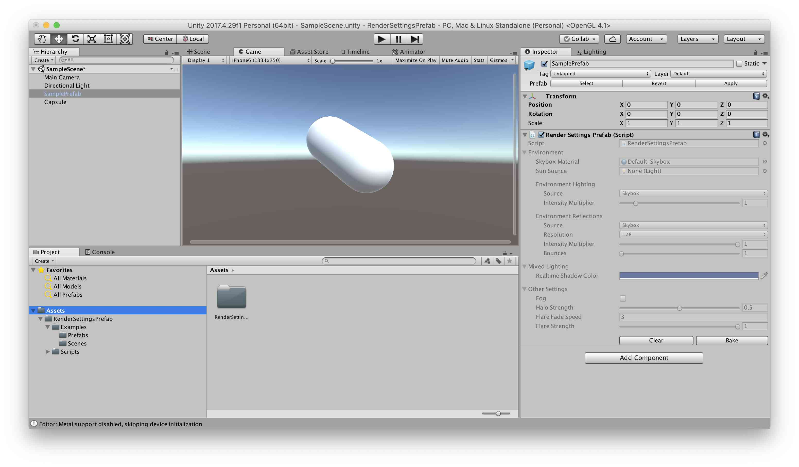

# RenderSettingsPrefab
## 概要
RenderSettings情報をプレハブに保存して、ランタイムで反映します。 

## アセット作成方法
1. 任意のシーンを開きます。
2. ヒエラルキーにあるプレハブのルートオブジェクトにRenderSettingsPrefabをAddします。
3. Lighting ウィンドウで任意の設定を行います。
4. 2のRenderSettingsPrefabにあるBakeボタンを押します。

## アセット使用方法
1. アセット作成方法で作ったプレハブをロードします。

## ポイント
- シーンビューで即時反映します。
